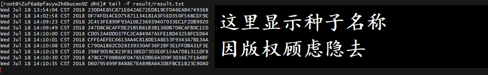

<h3 align="center">
  Distributed Hash Table Spider
</h3>

  
  
  

- 依赖 (Depend on)

  
  
  

- 运行方法 (How to run)

- 种子信息将储存在项目文件夹下的 reslut/result.txt &nbsp; 
- (Metainfo will be in ${ProjectDir}/reslut/result.txt)

